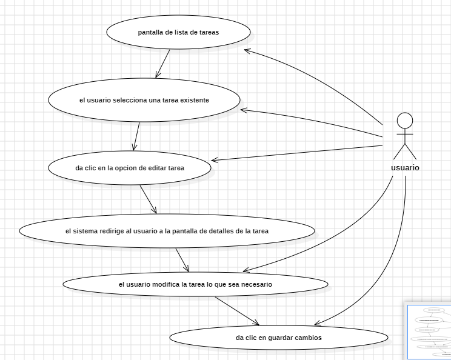
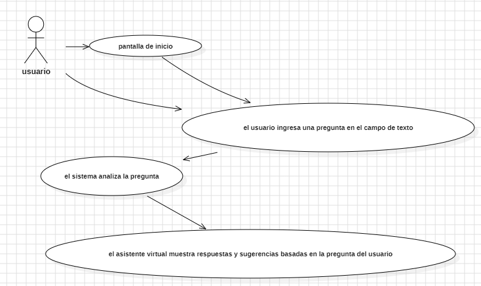

# Evidencia: GA2-220501093-AA1-EVO3: ELABORACIÓN CASOS DE USO E HISTORIAS DE USUARIO DEL PROYECTO CRONO-LOGIC

Erik Daniel Varela Monguí
Ángel Stiven López Ávila
Andrés Felipe Torres Ríos
Juan Pablo Reyes

Servicio Nacional de Aprendizaje-SENA
Tecnólogo en Análisis y Desarrollo de Software- ADSO
Ficha: 3000864
Instructor: Juan Fernando Jiménez

Tunja, Boyacá
26 de Octubre de 2024

## Tabla de Contenido

* Introducción: 
* Requisitos con casos de uso 
    * RF1. Registro 
        * Diagrama de casos de uso: pantalla de registro 
        * Historia de Usuario: Pantalla de registro 
    * RF2. Inicio de Sesión 
        * Diagrama de casos de uso: pantalla de inicio de sesión 
        * Historia de Usuario: Inicio de sesión de usuario 
    * RF3. Recuperación de Contraseña 
        * Diagrama de casos de uso: restablecimiento de contraseña 
        * Historia de Usuario: Restablecimiento de Contraseña para Usuarios 
    * RF4. Inicio de la app 
        * Diagrama de casos de uso: pantalla de inicio 
        * Historia de Usuario: Pantalla de Inicio 
    * RF5. Gestión de Tareas 
        * Diagrama de casos de uso: pantalla de lista de tareas 
        * Historia de Usuario: Pantalla de Lista de Tareas 
        * Diagrama de casos de uso: agregar tarea 
        * Historia de Usuario: Agregar una Tarea 
        * Diagrama de casos de uso: Editar tarea 
        * Historia de Usuario: Editar Tarea 
        * Diagrama de casos de uso: Eliminar tarea 
        * Eliminar tarea 
        * Historia de Usuario: Eliminar Tarea 
    * RF6. Agenda y Calendario 
        * Diagrama de casos de uso: Pantalla de calendario 
        * Historia de Usuario: Pantalla de Calendario 
        * Diagrama de casos de uso: Sincronización de calendarios 
        * Sincronización de calendarios 
        * Historia de Usuario: Sincronización de Calendario 
        * Diagrama de casos de uso: pantalla de visualización de eventos 
        * Historia de Usuario: Pantalla de Visualización de Eventos 
        * Diagrama de casos de uso: añadir eventos 
        * Historia de Usuario: Añadir Evento 
        * Diagrama de casos de uso: Editar eventos 
        * Historia de Usuario: Editar Evento 
        * Diagrama de casos de uso: Eliminar eventos 
        * Historia de Usuario: Eliminar Evento 
    * RF7. Gestión de Recordatorios 
        * Diagrama de casos de uso: pantalla de recordatorios 
        * Historia de Usuario: Pantalla de Recordatorios
        * Diagrama de casos de uso: visualización de los recordatorios 
        * visualización de los recordatorios 
        * Historia de Usuario: Visualización de Recordatorios 
        * Diagrama de casos de uso: Añadir recordatorios 
        * Historia de Usuario: Añadir Recordatorio 
        * Diagrama de casos de uso: Editar recordatorios 
        * Editar recordatorios 
        * Historia de Usuario: Editar Recordatorio 
        * Diagrama de casos de uso: Eliminación de recordatorios 
        * Eliminación de recordatorios 
        * Historia de Usuario: Eliminar Recordatorio 61
    * RF8. Asistente Virtual 
        * Diagrama de casos de uso: Interacción por texto 
        * Historia de Usuario: Interacción por Texto con el Asistente Virtual 64
        * Diagrama de casos de uso: Interacción por voz 65
        * Interacción por voz 
        * Historia de Usuario: Interacción por Voz con el Asistente Virtual 66
        * Diagrama de casos de uso: Sugerencias personalizadas 
        * Historia de Usuario: Sugerencias Personalizadas por el Asistente Virtual 
    * RF9. Seguimiento y Análisis 
        * Diagrama de casos de uso: pantalla de informes de actividad 
        * Historia de Usuario: Pantalla de Informes de Actividad 
        * Diagrama de casos de uso: pantalla de visualización de análisis de productividad 
        * pantalla de visualización de análisis de productividad 
        * Historia de Usuario: Pantalla de Visualización de Análisis de Productividad 
    * RF10. Integración con Correo Electrónico 
        * Diagrama de casos de uso: pantalla de administración de correos 
        * Historia de Usuario: Pantalla de Administración de Correos 
        * Diagrama de casos de uso: ver detalles de correos 
        * Historia de Usuario: Ver Detalles de Correos 
        * Diagrama de casos de uso: eliminar correos 
        * eliminar correos 
        * Historia de Usuario: Eliminar Correos 
    * RF11. Conexión con Dispositivos Tecnológicos 
        * Diagrama de casos de uso: visualizar pantalla de conexión con dispositivos 
        * Historia de Usuario: Visualizar Pantalla de Conexión con Dispositivos 
        * Diagrama de casos de uso: conexión con dispositivos inteligentes 
        * Historia de Usuario: Conexión con Dispositivos Inteligentes 
        * Diagrama de casos de uso: sincronización con dispositivos inteligentes 
        * sincronización con dispositivos inteligentes 
        * Historia de Usuario: Sincronización con Dispositivos Inteligentes 
        * Diagrama de casos de uso: control de dispositivos inteligentes 
        * Historia de Usuario: Control de Dispositivos Inteligentes 
    * RF12. Gestión de Noticias 
        * Diagrama de casos de uso: pantalla de noticias 
        * Historia de Usuario: Pantalla de Noticias 
        * Diagrama de casos de uso: visualización de noticias personalizadas 
        * Historia de Usuario: Visualización de Noticias Personalizadas 
        * Diagrama de casos de uso: visualización de detalles de noticias 
        * Historia de Usuario: Visualización de Detalles de Noticias 
    * RF13. Cierre de Sesión 
        * Diagrama de casos de uso: pantalla de cierre de sesión 
        * Historia de Usuario: Pantalla de Cierre de Sesión
        * Diagrama de casos de uso: mantener la sesión iniciada en el dispositivo 
        * Historia de Usuario: Mantener la Sesión Iniciada en el Dispositivo 
        * Diagrama de casos de uso: cierre de sesión
        * cierre de sesión
        * Historia de Usuario: Cierre de Sesión

## Introducción:

Los asistentes personales virtuales impulsados por inteligencia artificial (IA) han transformado la forma en que las personas interactúan con la tecnología en su vida diaria. Desde gestionar agendas y proporcionar recordatorios, hasta responder consultas y ejecutar tareas automatizadas, estos asistentes buscan mejorar la productividad y facilitar el acceso a la información. Para el desarrollo de un asistente personal virtual eficaz, resulta fundamental comprender profundamente las necesidades de los usuarios y traducirlas en historias de usuario, que representen los objetivos y expectativas reales de quienes interactuarán con la IA. Este trabajo se enfoca en la creación de historias de usuario para un proyecto de asistente personal virtual con IA, delineando diferentes roles, objetivos y expectativas que los usuarios pueden tener en sus interacciones. Las historias de usuario permiten definir escenarios claros y centrados en el usuario que guían el desarrollo y aseguran que el asistente satisfaga las necesidades específicas y aporte valor en diversas situaciones. A través de estas historias, se busca construir un asistente virtual que no solo cumpla con requerimientos funcionales, sino que también ofrezca una experiencia de usuario intuitiva y relevante.

## Requisitos con casos de uso

### RF1. Registro

El procedimiento RF1 corresponde al registro de usuarios, donde se ingresa nombre completo, dirección de correo electrónico, contraseña (con mínimo 8 caracteres, incluyendo mayúscula, minúscula, número y carácter especial) y confirmación de contraseña. Luego, se accede a términos y condiciones y, opcionalmente, se puede registrar con redes sociales. Finalmente, se envía el formulario y se reciben mensajes de error o éxito, incluyendo confirmación de registro y envío de correo de verificación.

#### Diagrama de casos de uso: pantalla de registro

**Caso de Uso No. 1**
**Nombre:** pantalla de registro
**Actor:** Usuario genérico
**Descripción:** El usuario proporciona información para obtener el registro de su cuenta
**Precondiciones:** El usuario debió descargar la app
**Criterios de Aceptación:**
* El usuario ingresa los datos básicos para el registro
* La aplicación valida las credenciales
* El usuario obtiene el registro de su cuenta
**Postcondiciones:** El usuario puede proceder a iniciar sesión en la app

#### Historia de Usuario: Pantalla de registro

* **Nombre de historia de usuario:** Registro de usuario en el sistema
* **Cómo:** nuevo usuario de la aplicación
* **Puedo:** registrarme en el sistema proporcionando mi información personal
* **Para:** acceder a todas las funcionalidades de la aplicación
* **Criterios de aceptación:**
    * **Dado que** soy un nuevo usuario interesado en la aplicación
    * **Cuando** ingreso mis datos de registro y confirmo la acción
    * **Entonces** el sistema me crea una cuenta y me permite iniciar sesión
* **Detalles:**
    * **Reglas de negocio:**
        1.  El usuario debe ser mayor de 18 años para poder registrarse.
        2.  El correo electrónico ingresado debe ser único y no haber sido registrado previamente.
        3.  La contraseña debe tener un mínimo de 8 caracteres, incluyendo al menos una letra mayúscula, una minúscula, un número y un carácter especial.
    * **Requerimiento no funcional:**
        * El sistema debe procesar el registro en menos de 3 segundos.
        * Los datos del usuario deben almacenarse de forma segura cumpliendo con los estándares de protección de datos.
    * **Otros detalles importantes:**
        * El usuario recibirá un correo electrónico de confirmación después de completar el registro.
        * Se debe informar al usuario de cualquier error de validación en el formulario de registro, como contraseñas débiles o correos electrónicos ya existentes.

### RF2. Inicio de Sesión

El procedimiento RF1 corresponde al Inicio de sesión, para acceder a una cuenta mediante correo electrónico y contraseña, con opciones de recuperación, recordatorio y acceso con redes sociales, mostrando mensajes de error o éxito y redirigiendo a la pantalla principal en caso de éxito.

#### Diagrama de casos de uso: pantalla de inicio de sesión

**Caso de Uso No. 2**
**Nombre:** pantalla de inicio de sesión
**Actor:** Usuario genérico
**Descripción:** El usuario debe dar información del usuario registrado para entrar a la interfaz de la app
**Precondiciones:** El usuario debe tener una cuenta registrada en la aplicación.
**Criterios de Aceptación:**
* El usuario debe poder ingresar su nombre de usuario y contraseña.
* Si las credenciales son correctas, el sistema debe permitir el acceso al usuario
* Si las credenciales son incorrectas, el sistema debe mostrar un mensaje de error indicando que las credenciales son inválidas
* El sistema debe ofrecer la opción de restablecer la contraseña en caso de que el usuario la haya olvidado.
**Postcondiciones:**
* El usuario está autenticado y se le redirige a la página principal de la aplicación.
* Se debe guardar el estado de la sesión del usuario.

#### Historia de Usuario: Inicio de sesión de usuario

* **Nombre de historia:** Inicio de sesión seguro para usuarios registrados
* **Cómo:** Usuario registrado
* **Puedo:** Iniciar sesión en la aplicación
* **Para:** Acceder a mis datos y funcionalidades personalizadas
* **Criterios de Aceptación:**
    * **Dado que** soy un usuario registrado
    * **Cuando** ingreso mi correo electrónico y contraseña correctos en la pantalla de inicio de sesión
    * **Entonces** se me permitirá acceder al sistema y ver mi perfil
    * **Dado que** soy un usuario registrado que ingresó una contraseña incorrecta
    * **Cuando** intento iniciar sesión
    * **Entonces** se me mostrará un mensaje de error indicando que las credenciales son incorrectas
* **Detalles:**
    * **Reglas de negocio:**
        1.  Solo los usuarios registrados pueden iniciar sesión.
        2.  Si el usuario no ha verificado su correo electrónico, no puede iniciar sesión hasta que lo haga.
        3.  El sistema bloqueará la cuenta después de cinco intentos fallidos de inicio de sesión para evitar accesos no autorizados.
    * **Requerimiento no funcional:**
        * La respuesta del sistema al intentar iniciar sesión debe ser en menos de 2 segundos.
        * La interfaz de inicio de sesión debe ser accesible en dispositivos móviles y de escritorio.
        * El sistema debe usar cifrado para proteger las credenciales del usuario.
    * **Otros detalles importantes:**
        * El sistema debe registrar cada intento de inicio de sesión para auditoría.
        * El usuario debe tener la opción de recuperar su contraseña en caso de olvidarla

### RF3. Recuperación de Contraseña

Recuperación de contraseña: proceso para restablecer acceso a una cuenta, enviando una solicitud con el correo asociado, recibiendo instrucciones por correo y actualizando la contraseña a una nueva que cumpla con los requisitos, con mensajes de confirmación o error en cada paso.

#### Diagrama de casos de uso: restablecimiento de contraseña

**Caso de Uso No. 3**
**Nombre:** restablecimiento de contraseña
**Actor:** Usuario genérico
**Descripción:** Este caso de uso permite a un usuario restablecer su contraseña en caso de que la haya olvidado. El usuario recibirá un enlace para restablecer su contraseña a través de su correo electrónico registrado.
**Precondiciones:**
* El usuario debe tener una cuenta registrada en la aplicación.
* El usuario debe tener acceso al correo electrónico asociado a su cuenta.
**Criterios de Aceptación:**
* El usuario debe poder ingresar su dirección de correo electrónico en el formulario de restablecimiento de contraseña.
* El sistema debe enviar un correo electrónico con un enlace para restablecer la contraseña si la dirección es válida y está asociada a una cuenta.
* El enlace debe llevar al usuario a una página donde pueda ingresar y confirmar una nueva contraseña.
* La nueva contraseña debe cumplir con los requisitos de seguridad (longitud mínima, caracteres especiales, etc.).
* Una vez restablecida, el usuario debe poder iniciar sesión con la nueva contraseña.
**Postcondiciones:**
* La contraseña del usuario se actualiza en la base de datos.
* Se envía un correo de confirmación al usuario informando que su contraseña ha sido cambiada exitosamente.

#### Historia de Usuario: Restablecimiento de Contraseña para Usuarios

* **Nombre de historia:** Restablecimiento seguro de contraseña para usuarios
* **Cómo:** Usuario registrado
* **Puedo:** Restablecer mi contraseña
* **Para:** Recuperar el acceso a mi cuenta en caso de olvido de la contraseña
* **Criterios de Aceptación:**
    * **Dado que** soy un usuario registrado que ha olvidado su contraseña
    * **Cuando** ingreso mi correo electrónico en la opción de restablecimiento de contraseña
    * **Entonces** el sistema me enviará un enlace para restablecer la contraseña al correo electrónico registrado
    * **Dado que** recibí un enlace de restablecimiento de contraseña
    * **Cuando** hago clic en el enlace e ingreso una nueva contraseña válida
    * **Entonces** mi contraseña se actualizará y podré acceder al sistema con la nueva contraseña
* **Detalles:**
    * **Reglas de negocio:**
        1.  El enlace de restablecimiento de contraseña tendrá una validez de 24 horas.
        2.  El usuario debe ingresar una contraseña que cumpla con los criterios de seguridad definidos (mínimo de 8 caracteres, combinación de letras, números y símbolos).
        3.  Si el enlace de restablecimiento caduca, el usuario debe solicitar un nuevo enlace.
    * **Requerimiento no funcional:**
        * La solicitud de restablecimiento de contraseña debe procesarse en menos de 5 segundos.
        * El enlace de restablecimiento debe estar cifrado para proteger la seguridad del usuario.
        * El proceso de restablecimiento debe ser accesible tanto en dispositivos móviles como de escritorio.
    * **Otros detalles importantes:**
        * El sistema debe registrar cada intento de restablecimiento para auditoría y seguridad.
        * El usuario debe recibir un mensaje de confirmación después de cambiar exitosamente la contraseña.

### RF4. Inicio de la app

Inicio de la app: Pantalla inicial que permite al usuario acceder a diferentes secciones de la app y utilizar el asistente virtual, seleccionando la pantalla deseada y recibiendo ayuda y sugerencias para mejorar la experiencia de uso.

#### Diagrama de casos de uso: pantalla de inicio

**Caso de Uso No. 4**
**Nombre:** pantalla de inicio
**Actor:** Usuario genérico
**Descripción:** Este caso de uso muestra la pantalla de inicio de la aplicación después de que el usuario ha iniciado sesión. La pantalla de inicio proporciona acceso a las principales funcionalidades y recursos disponibles en la aplicación.
**Precondiciones:** El usuario debe haber iniciado sesión correctamente en la aplicación
**Criterios de Aceptación:**
* La pantalla de inicio debe mostrar el saludo al usuario (por ejemplo, "Bienvenido, [Nombre de Usuario]").
* Deben estar disponibles accesos directos a las principales funciones de la aplicación (por ejemplo, “Perfil”, “Configuración”, “Asistencia” y “Cerrar sesión”).
* La pantalla debe incluir un menú de navegación visible y accesible.
* Debe haber una opción para acceder a ayuda o tutoriales sobre el uso de la aplicación.
* Si el usuario no ha realizado ninguna acción en un tiempo determinado, se debe mostrar un aviso de inactividad.
**Postcondiciones:**
* El usuario puede interactuar con las diferentes funciones de la aplicación a través de la pantalla de inicio.
* El sistema mantiene el estado de la sesión activa del usuario.

#### Historia de Usuario: Pantalla de Inicio

* **Nombre de historia:** Acceso a la pantalla de inicio
* **Cómo:** Usuario registrado
* **Puedo:** Acceder a la pantalla de inicio
* **Para:** Ver las opciones y navegar fácilmente por la aplicación
* **Criterios de Aceptación:**
    * **Dado que** soy un usuario registrado
    * **Cuando** inicio sesión correctamente
    * **Entonces** seré dirigido a la pantalla de inicio, donde veré un menú de navegación y mis tareas pendientes
* **Detalles:**
    * **Reglas de negocio:**
        1.  Solo los usuarios registrados pueden acceder a la pantalla de inicio.
        2.  La pantalla debe mostrar un resumen de las tareas pendientes.
    * **Requerimiento no funcional:**
        * La pantalla de inicio debe cargar en menos de 2 segundos.
    * **Otros detalles importantes:**
        * La pantalla debe ser responsiva para dispositivos móviles y de escritorio.

### RF5. Gestión de Tareas

Gestión de Tareas: Pantalla para organizar y administrar tareas, mostrando una lista con detalles y opciones para filtrar, ordenar, agregar, editar, eliminar, marcar como completadas y guardar cambios, permitiendo a los usuarios controlar y priorizar sus tareas de manera eficiente.

#### Diagrama de casos de uso: pantalla de lista de tareas

**Caso de Uso No. 5**
**Nombre:** pantalla de lista de tareas
**Actor:** Usuario genérico
**Descripción:** Este caso de uso permite al usuario visualizar, gestionar y organizar sus tareas dentro de la aplicación. La pantalla muestra una lista de tareas pendientes y completadas, así como opciones para agregar, editar o eliminar tareas.
**Precondiciones:**
* El usuario debe haber iniciado sesión en la aplicación.
* El usuario debe tener al menos una tarea creada previamente.
**Criterios de Aceptación:**
* La pantalla de lista de tareas debe mostrar todas las tareas del usuario, organizadas por estado (pendientes, completadas).
* Cada tarea debe mostrar información relevante como el título, la fecha de vencimiento y el estado (pendiente/completada).
* El usuario debe poder agregar nuevas tareas mediante un botón de "Agregar tarea".
* El usuario debe poder editar tareas existentes seleccionándolas y modificando los detalles.
* El usuario debe poder marcar tareas como completadas o eliminarlas de la lista.
* Debe haber un sistema de filtrado para visualizar tareas según criterios específicos (por fecha, estado, prioridad, etc.).
**Postcondiciones:**
* Las acciones realizadas (agregar, editar, completar o eliminar tareas) se reflejan en la lista de tareas en tiempo real.
* El estado de las tareas se actualiza y se guarda en la base de datos del usuario.

#### Historia de Usuario: Pantalla de Lista de Tareas

* **Nombre de historia:** Visualización de lista de tareas
* **Cómo:** Usuario registrado
* **Puedo:** Ver la lista de tareas
* **Para:** Tener una visión clara de las tareas pendientes y completadas
* **Criterios de Aceptación:**
    * **Dado que** soy un usuario registrado
    * **Cuando** accedo a la lista de tareas
    * **Entonces** veré todas las tareas ordenadas por estado (pendiente, completada)
* **Detalles:**
    * **Reglas de negocio:**
        1.  Las tareas deben mostrarse en orden cronológico, primero las más recientes.
        2.  El usuario debe poder ver el estado de cada tarea.
    * **Requerimiento no funcional:**
        * La carga de la lista de tareas no debe tardar más de 3 segundos.
    * **Otros detalles importantes:**
        * El usuario debe poder filtrar y buscar tareas en la lista.

#### Diagrama de casos de uso: agregar tarea

**Caso de Uso No. 6**
**Nombre:** agregar tarea
**Actor:** Usuario genérico
**Descripción:** Este caso de uso permite al usuario crear una nueva tarea en la aplicación, especificando detalles como el título, la descripción, la fecha de vencimiento y la prioridad.
**Precondiciones:**
* El usuario debe haber iniciado sesión en la aplicación.
* El usuario debe estar en la pantalla de lista de tareas.
**Criterios de Aceptación:**
* El usuario debe poder acceder a un formulario para agregar una nueva tarea mediante un botón de "Agregar tarea".
* El formulario debe permitir al usuario ingresar los siguientes detalles:
    * Título de la tarea (campo obligatorio).
    * Descripción de la tarea (opcional).
    * Fecha de vencimiento (opcional).
    * Prioridad (baja, media, alta) (opcional).
* El sistema debe validar que el título de la tarea no esté vacío antes de permitir la creación.
* Al guardar la tarea, el sistema debe mostrar un mensaje de confirmación de que la tarea ha sido agregada exitosamente.
* La nueva tarea debe aparecer en la lista de tareas en tiempo real.
**Postcondiciones:**
* La nueva tarea se guarda en la base de datos del usuario y se refleja en la pantalla de lista de tareas.
* El usuario puede ver y gestionar la tarea en cualquier momento después de haberla agregado.

#### Historia de Usuario: Agregar una Tarea

* **Nombre de historia:** Creación de una nueva tarea
* **Cómo:** Usuario registrado
* **Puedo:** Agregar una nueva tarea
* **Para:** Mantener un registro de las actividades que debo realizar
* **Criterios de Aceptación:**
    * **Dado que** soy un usuario registrado
    * **Cuando** ingreso el nombre y detalles de una tarea y la guardo
    * **Entonces** la tarea se agregará a la lista de tareas pendientes
* **Detalles:**
    * **Reglas de negocio:**
        1.  Las tareas deben tener un nombre único y una fecha límite opcional.
        2.  Las tareas recién creadas deben aparecer en la lista de tareas pendientes.
    * **Requerimiento no funcional:**
        * La acción de agregar una tarea debe procesarse en menos de 2 segundos.
    * **Otros detalles importantes:**
        * La interfaz debe mostrar una confirmación de que la tarea fue agregada con éxito.

#### Diagrama de casos de uso: Editar tarea

**Caso de Uso No. 7**
**Nombre:** Editar tarea
**Actor:** Usuario genérico
**Descripción:** Este caso de uso permite al usuario modificar los detalles de una tarea existente en la aplicación, incluyendo su título, descripción, fecha de vencimiento y prioridad.
**Precondiciones:**
* El usuario debe estar en la pantalla de lista de tareas.
* El usuario debe tener al menos una tarea existente en su lista de tareas.
**Criterios de Aceptación:**
* El usuario debe poder seleccionar una tarea de la lista para editar.
* Al seleccionar la tarea, el sistema debe mostrar un formulario prellenado con los detalles actuales de la tarea.
* El usuario debe poder modificar los siguientes campos:
    * Título de la tarea (campo obligatorio).
    * Descripción de la tarea (opcional).
    * Fecha de vencimiento (opcional).
    * Prioridad (baja, media, alta) (opcional).
* El sistema debe validar que el título de la tarea no esté vacío antes de permitir la actualización.
* Al guardar los cambios, el sistema debe mostrar un mensaje de confirmación de que la tarea ha sido actualizada exitosamente.
* Los cambios realizados deben reflejarse en la lista de tareas en tiempo real.
**Postcondiciones:**
* Los detalles de la tarea se actualizan en la base de datos del usuario y se muestran correctamente en la pantalla de lista de tareas.
* El usuario puede ver y gestionar la tarea editada en cualquier momento después de realizar los cambios.

#### Historia de Usuario: Editar Tarea

* **Nombre de historia:** Modificación de una tarea existente
* **Cómo:** Usuario registrado
* **Puedo:** Editar una tarea existente
* **Para:** Actualizar la información o cambiar detalles de mis tareas
* **Criterios de Aceptación:**
    * **Dado que** tengo una tarea en la lista
    * **Cuando** accedo a la opción de editar y modifico los datos
    * **Entonces** los cambios deben guardarse y reflejarse en la lista de tareas
* **Detalles:**
    * **Reglas de negocio:**
        1.  Solo el usuario que creó la tarea puede editarla.
        2.  El nombre de la tarea no debe estar vacío después de la edición.
    * **Requerimiento no funcional:**
        * La actualización de una tarea debe realizarse en menos de 2 segundos.
    * **Otros detalles importantes:**
        * El usuario debe recibir una notificación confirmando que los cambios fueron guardados.

#### Diagrama de casos de uso: Eliminar tarea

**Caso de Uso No. 8**
**Nombre:** Eliminar tarea
**Actor:** Usuario genérico
**Descripción:** Este caso de uso permite al usuario eliminar una tarea existente de su lista en la aplicación. Al eliminarla, la tarea se elimina de la base de datos del usuario.
**Precondiciones:**
* El usuario debe haber iniciado sesión en la aplicación.
* El usuario debe tener al menos una tarea en su lista de tareas.
**Criterios de Aceptación:**
* El usuario debe poder seleccionar una tarea de la lista que desea eliminar.
* Al seleccionar la tarea, el sistema debe ofrecer una opción para "Eliminar" la tarea.
* Al hacer clic en "Eliminar", el sistema debe mostrar un mensaje de confirmación, preguntando al usuario si está seguro de que desea eliminar la tarea.
* Si el usuario confirma, el sistema debe eliminar la tarea de la base de datos y mostrar un mensaje de confirmación indicando que la tarea ha sido eliminada exitosamente.
* La tarea eliminada debe desaparecer de la lista de tareas en tiempo real.
**Postcondiciones:**
* La tarea seleccionada se elimina de la base de datos del usuario y ya no se muestra en la pantalla de lista de tareas.
* El usuario puede ver y gestionar el resto de las tareas restantes en su lista.

#### Historia de Usuario: Eliminar Tarea

* **Nombre de historia:** Eliminación de una tarea
* **Cómo:** Usuario registrado
* **Puedo:** Eliminar una tarea
* **Para:** Limpiar la lista de tareas y descartar actividades completadas o innecesarias
* **Criterios de Aceptación:**
    * **Dado que** tengo una tarea en la lista
    * **Cuando** selecciono la opción de eliminar tarea y confirmo la acción
    * **Entonces** la tarea se eliminará de la lista de tareas
* **Detalles:**
    * **Reglas de negocio:**
        1.  Solo el usuario que creó la tarea puede eliminarla.
        2.  La eliminación debe requerir una confirmación para evitar errores.
    * **Requerimiento no funcional:**
        * La acción de eliminación debe completarse en menos de 2 segundos.
    * **Otros detalles importantes:**
        * La interfaz debe mostrar un mensaje confirmando la eliminación exitosa de la tarea.

### RF6. Agenda y Calendario

Agenda y Calendario: Pantalla para organizar y visualizar eventos y tareas en un calendario, con vistas diaria, semanal y mensual, permitiendo añadir eventos con detalles, sincronizar con calendarios externos y editar o eliminar eventos existentes, para una gestión eficiente del tiempo y compromisos.

#### Diagrama de casos de uso: Pantalla de calendario

**Caso de Uso No. 9**
**Nombre:** Pantalla de calendario
**Actor:** Usuario genérico
**Descripción:** Este caso de uso permite al usuario visualizar un calendario que muestra las tareas programadas en fechas específicas. El usuario puede interactuar con el calendario para...

#### Historia de Usuario: Pantalla de Calendario

* **Nombre de historia:** Visualización del calendario de eventos
* **Cómo:** Usuario registrado
* **Puedo:** Acceder a la pantalla de calendario
* **Para:** Ver mis eventos y tareas programadas en un formato visual
* **Criterios de Aceptación:**
    * **Dado que** soy un usuario registrado
    * **Cuando** accedo a la pantalla de calendario
    * **Entonces** veré un calendario con mis eventos y tareas en las fechas correspondientes
* **Detalles:**
    * **Reglas de negocio:**
        1.  El calendario debe mostrar los eventos en diferentes vistas (día, semana, mes).
        2.  Los eventos deben ser distinguibles de las tareas.
    * **Requerimiento no funcional:**
        * La carga del calendario no debe tardar más de 3 segundos.
    * **Otros detalles importantes:**
        * El usuario debe poder agregar eventos directamente desde la vista del calendario.

#### Diagrama de casos de uso: Sincronización de calendarios

**Caso de Uso No. 10**
**Nombre:** Sincronización de calendarios
**Actor:** Usuario genérico
**Descripción:** Este caso de uso permite al usuario sincronizar sus tareas y eventos con aplicaciones de calendario externas, como Google Calendar o Microsoft Outlook. Esto asegura que las tareas y eventos estén actualizados y accesibles desde múltiples plataformas.
**Precondiciones:** El usuario debe estar en la pantalla de calendario.
**Criterios de Aceptación:**
* El usuario debe poder acceder a la opción de sincronización desde la pantalla de configuración de la aplicación.
* Al seleccionar la opción de sincronización, el usuario debe poder elegir el servicio de calendario externo deseado (por ejemplo, Google Calendar).
* El sistema debe guiar al usuario a través del proceso de autorización para conectar su cuenta de calendario externo con la aplicación.
* Una vez autorizada, el sistema debe sincronizar automáticamente las tareas y eventos del usuario en la aplicación con el calendario externo.
* El usuario debe recibir una notificación de que la sincronización se ha realizado con éxito.
* Las actualizaciones en la aplicación (agregar, editar o eliminar tareas) deben reflejarse en el calendario externo y viceversa.
**Postcondiciones:**
* Las tareas y eventos del usuario están sincronizados entre la aplicación y el calendario externo.
* El usuario puede ver y gestionar sus tareas desde ambas plataformas, garantizando que la información esté siempre actualizada.

#### Historia de Usuario: Sincronización de Calendario

* **Nombre de historia:** Sincronización del calendario con otras plataformas
* **Cómo:** Usuario
* **Puedo:** Sincronizar mi calendario con otras plataformas (Google, Outlook)
* **Para:** Tener todos mis eventos organizados en un solo lugar
* **Criterios de Aceptación:**
    * **Dado que** soy un usuario registrado
    * **Cuando** activo la opción de sincronización
    * **Entonces** mis eventos externos deben aparecer en el calendario de la aplicación
* **Detalles:**
    * **Reglas de negocio:**
        1.  La sincronización debe respetar los permisos de cada cuenta conectada.
        2.  Los eventos sincronizados deben actualizarse automáticamente.
    * **Requerimiento no funcional:**
        * La sincronización debe completarse en menos de 5 segundos.
    * **Otros detalles importantes:**
        * Los eventos sincronizados deben poder visualizarse en todas las vistas (día, semana, mes).

#### Diagrama de casos de uso: pantalla de visualización de eventos

**Caso de Uso No. 11**
**Nombre:** pantalla de visualización de eventos
**Actor:** Usuario genérico
**Descripción:** Este caso de uso permite al usuario visualizar una lista detallada de todos los eventos programados en la aplicación. La pantalla debe mostrar información clave de cada evento y ofrecer opciones para interactuar con ellos.
**Precondiciones:** El usuario debe haber iniciado sesión en la aplicación.
**Criterios de Aceptación:**
* La pantalla de visualización de eventos debe mostrar una lista clara y organizada de todos los eventos del usuario, ordenados cronológicamente.
* Cada evento en la lista debe mostrar información esencial como el título, la fecha, la hora y una breve descripción.
* El usuario debe poder filtrar y buscar eventos por diferentes criterios (por ejemplo, fecha, palabra clave, tipo de evento).
* Al seleccionar un evento de la lista, el usuario debe poder acceder a una vista detallada del mismo.
* La pantalla debe ofrecer opciones para agregar un nuevo evento, así como editar o eliminar eventos existentes.
**Postcondiciones:**
* El usuario puede ver un resumen completo de sus eventos y navegar fácilmente entre ellos.
* Las acciones realizadas (agregar, editar, eliminar) se reflejan en tiempo real en la lista de eventos.

#### Historia de Usuario: Pantalla de Visualización de Eventos

* **Nombre de historia:** Visualización de eventos programados
* **Cómo:** Usuario registrado
* **Puedo:** Ver los eventos programados
* **Para:** Mantener un seguimiento de mis compromisos y citas importantes
* **Criterios de Aceptación:**
    * **Dado que** soy un usuario registrado
    * **Cuando** accedo a la pantalla de eventos
    * **Entonces** veré una lista de todos mis eventos, ordenados por fecha y hora
* **Detalles:**
    * **Reglas de negocio:**
        1.  Los eventos deben mostrar la hora de inicio y fin.
        2.  Los eventos pasados deben tener una indicación visual distinta.
    * **Requerimiento no funcional:**
        * La carga de la lista de eventos debe ser en menos de 3 segundos.
    * **Otros detalles importantes:**
        * El usuario debe poder filtrar eventos por categorías.

#### Diagrama de casos de uso: añadir eventos

**Caso de Uso No. 12**
**Nombre:** añadir eventos
**Actor:** Usuario genérico
**Descripción:** Este caso de uso permite al usuario crear un nuevo evento en la aplicación, especificando detalles como el título, la descripción, la fecha, la hora y la duración del evento.
**Precondiciones:** El usuario debe estar en la pantalla de calendario.
**Criterios de Aceptación:**
* El usuario debe poder acceder a un formulario para agregar un nuevo evento mediante un botón de "Agregar evento".
* El formulario debe permitir al usuario ingresar los siguientes detalles:
    * Título del evento (campo obligatorio).
    * Descripción del evento (opcional).
    * Fecha del evento (campo obligatorio).
    * Hora de inicio (campo obligatorio).
    * Duración del evento (opcional).
    * Tipo de evento (opcional; por ejemplo, reunión, recordatorio, tarea).
* El sistema debe validar que el título y la fecha del evento no estén vacíos antes de permitir la creación.
* Al guardar el evento, el sistema debe mostrar un mensaje de confirmación de que el evento ha sido agregado exitosamente.
* El nuevo evento debe aparecer en la lista de eventos en tiempo real.
**Postcondiciones:**
* El nuevo evento se guarda en la base de datos del usuario y se refleja en la pantalla de visualización de eventos.
* El usuario puede ver y gestionar el evento en cualquier momento después de haberlo agregado.

#### Historia de Usuario: Añadir Evento

* **Nombre de historia:** Creación de un nuevo evento
* **Cómo:** Usuario
* **Puedo:** Agregar un nuevo evento al calendario
* **Para:** Organizar y recordar mis citas y compromisos
* **Criterios de Aceptación:**
    * **Dado que** quiero añadir un evento
    * **Cuando** ingreso los detalles del evento (nombre, fecha, hora) y lo guardo
    * **Entonces** el evento se agregará a mi calendario
* **Detalles:**
    * **Reglas de negocio:**
        1.  Los eventos deben tener un título y una fecha/hora obligatorios.
        2.  Se puede añadir una descripción y una ubicación opcionales.
    * **Requerimiento no funcional:**
        * La creación del evento debe completarse en menos de 2 segundos.
    * **Otros detalles importantes:**
        * El usuario debe recibir una confirmación visual de que el evento fue añadido.

#### Diagrama de casos de uso: Editar eventos

**Caso de Uso No. 13**
**Nombre:** Editar Eventos
**Actor:** Usuario genérico
**Descripción:** Este caso de uso permite al usuario modificar un evento existente en la aplicación, permitiendo cambios en el título, la descripción, la fecha, la hora, la duración y el tipo de evento.
**Precondiciones:** El usuario debe estar en la pantalla de detalles del evento.
**Criterios de Aceptación:**
* El usuario debe poder seleccionar un evento existente desde la lista de eventos para editarlo.
* El sistema debe proporcionar un formulario de edición que contenga los detalles actuales del evento.
* El sistema debe validar que el título y la fecha del evento no estén vacíos antes de permitir la actualización.
**Postcondiciones:** El evento actualizado se guarda en la base de datos del usuario y se muestra con las modificaciones en la pantalla de visualización de eventos.

#### Historia de Usuario: Editar Evento

* **Nombre de historia:** Modificación de un evento existente
* **Cómo:** Usuario
* **Puedo:** Editar un evento existente
* **Para:** Ajustar los detalles si hay cambios en la fecha, hora o información del evento
* **Criterios de Aceptación:**
    * **Dado que** tengo un evento en el calendario
    * **Cuando** selecciono editar y modifico los detalles
    * **Entonces** el sistema guardará los cambios y actualizará el evento en el calendario
* **Detalles:**
    * **Reglas de negocio:**
        1.  Solo el usuario que creó el evento puede editarlo.
        2.  Los cambios deben reflejarse de inmediato en el calendario.
    * **Requerimiento no funcional:**
        * La edición del evento debe procesarse en menos de 2 segundos.
    * **Otros detalles importantes:**
        * El usuario debe recibir una notificación de que los cambios fueron guardados.

#### Diagrama de casos de uso: Eliminar eventos

**Caso de Uso No. 14**
**Nombre:** Eliminar eventos
**Actor:** Usuario genérico
**Descripción:** Este caso de uso permite al usuario eliminar uno o varios eventos de su calendario en la aplicación. La eliminación puede ser temporal (moviendo el evento a una papelera) o permanente.
**Precondiciones:** El usuario debe haber iniciado sesión en la aplicación.
**Criterios de Aceptación:**
* El usuario debe poder seleccionar un evento del calendario que desea eliminar.
* Al seleccionar el evento, el sistema debe ofrecer una opción para "Eliminar" el evento.
* Al hacer clic en "Eliminar", el sistema debe mostrar un mensaje de confirmación, preguntando al usuario si está seguro de que desea eliminar el evento.
* Si el usuario confirma, el sistema debe eliminar el evento de la base de datos y mostrar un mensaje de confirmación indicando que el evento ha sido eliminado exitosamente.
* El evento eliminado debe desaparecer del calendario en tiempo real.
**Postcondiciones:**
* El evento seleccionado se elimina de la base de datos del usuario y ya no se muestra en el calendario.
* El usuario puede ver y gestionar el resto de los eventos restantes en su calendario.

#### Historia de Usuario: Eliminar Evento

* **Nombre de historia:** Eliminación de un evento
* **Cómo:** Usuario
* **Puedo:** Eliminar un evento
* **Para:** Limpiar mi calendario y descartar citas o compromisos que ya no son relevantes
* **Criterios de Aceptación:**
    * **Dado que** tengo un evento en el calendario
    * **Cuando** selecciono la opción de eliminar y confirmo la acción
    * **Entonces** el evento será eliminado de mi calendario
* **Detalles:**
    * **Reglas de negocio:**
        1.  Solo el usuario que creó el evento puede eliminarlo.
        2.  La eliminación debe requerir una confirmación.
    * **Requerimiento no funcional:**
        * La acción de eliminación debe completarse en menos de 2 segundos.
    * **Otros detalles importantes:**
        * La interfaz debe mostrar un mensaje de confirmación tras la eliminación exitosa.

### RF7. Gestión de Recordatorios

Gestión de Recordatorios: Pantalla para organizar y administrar recordatorios, mostrando una lista con detalles y opciones para filtrar, ordenar, añadir, editar, eliminar y marcar como completados, permitiendo a los usuarios controlar y priorizar sus recordatorios de manera eficiente.

#### Diagrama de casos de uso: pantalla de recordatorios

**Caso de Uso No. 15**
**Nombre:** pantalla de recordatorios
**Actor:** Usuario genérico
**Descripción:** Este caso de uso permite al usuario visualizar y gestionar sus recordatorios dentro de la aplicación. La pantalla muestra una lista de recordatorios pendientes y completados, así como opciones para agregar, editar o eliminar recordatorios.
**Precondiciones:**
* El usuario debe haber iniciado sesión en la aplicación.
* El usuario debe tener al menos un recordatorio creado previamente.
**Criterios de Aceptación:**
* La pantalla de recordatorios debe mostrar todos los recordatorios del usuario, organizados por estado (pendientes, completados) y fecha.
* Cada recordatorio debe mostrar información relevante como el título, la fecha y hora de vencimiento, y el estado (pendiente/completado).
* El usuario debe poder agregar nuevos recordatorios mediante un botón de "Agregar recordatorio".
* El usuario debe poder editar recordatorios existentes seleccionándolos y modificando los detalles.
* El usuario debe poder marcar recordatorios como completados o eliminarlos de la lista.
* Debe haber un sistema de filtrado para visualizar recordatorios según criterios específicos (por fecha, estado, prioridad, etc.).
**Postcondiciones:**
* Las acciones realizadas (agregar, editar, completar o eliminar recordatorios) se reflejan en la lista de recordatorios en tiempo real.
* El estado de los recordatorios se actualiza y se guarda en la base de datos del usuario.

#### Historia de Usuario: Pantalla de Recordatorios

* **Nombre de historia:** Visualización de la lista de recordatorios
* **Cómo:** Usuario registrado
* **Puedo:** Ver la lista de recordatorios
* **Para:** Tener una visión clara de mis recordatorios pendientes y completados
* **Criterios de Aceptación:**
    * **Dado que** soy un usuario registrado
    * **Cuando** accedo a la lista de recordatorios
    * **Entonces** veré todos mis recordatorios ordenados por fecha y hora
* **Detalles:**
    * **Reglas de negocio:**
        1.  Los recordatorios deben mostrar la fecha y hora de la notificación.
        2.  Los recordatorios completados deben tener una indicación visual distinta.
    * **Requerimiento no funcional:**
        * La carga de la lista de recordatorios no debe tardar más de 3 segundos.
    * **Otros detalles importantes:**
        * El usuario debe poder filtrar y buscar recordatorios.

#### Diagrama de casos de uso: visualización de los recordatorios

**Caso de Uso No. 16**
**Nombre:** visualización de los recordatorios
**Actor:** Usuario genérico
**Descripción:** Este caso de uso permite al usuario ver los detalles de un recordatorio específico, proporcionando información completa sobre el mismo.
**Precondiciones:** El usuario está en la pantalla de recordatorios.
**Criterios de Aceptación:**
* El usuario debe poder seleccionar un recordatorio de la lista para ver sus detalles.
* El usuario debe poder regresar a la lista de recordatorios después de visualizar un recordatorio sin perder su lugar en la lista.
* Al seleccionar un recordatorio, el sistema debe abrir una pantalla o un modal que muestre información detallada
**Postcondiciones:** Cualquier cambio realizado (como marcar como completado, editar o eliminar) se refleja en la lista de recordatorios en tiempo real.

#### Historia de Usuario: Visualización de Recordatorios

* **Nombre de historia:** Visualización de un recordatorio específico
* **Cómo:** Usuario
* **Puedo:** Ver los detalles de un recordatorio específico
* **Para:** Revisar la información completa de una notificación importante
* **Criterios de Aceptación:**
    * **Dado que** tengo un recordatorio en la lista
    * **Cuando** selecciono el recordatorio
    * **Entonces** se abrirá una pantalla con la información completa del recordatorio
* **Detalles:**
    * **Reglas de negocio:**
        1.  La vista de detalles debe incluir la fecha, hora, descripción y si es recurrente.
    * **Requerimiento no funcional:**
        * La carga de los detalles del recordatorio debe ser en menos de 2 segundos.
    * **Otros detalles importantes:**
        * El usuario debe poder editar o eliminar el recordatorio desde esta vista.

#### Diagrama de casos de uso: Añadir recordatorios

**Caso de Uso No. 17**
**Nombre:** Añadir recordatorios
**Actor:** Usuario genérico
**Descripción:** Este caso de uso permite al usuario crear un nuevo recordatorio en la aplicación, especificando detalles como el título, la descripción, la fecha, la hora y la frecuencia del recordatorio.
**Precondiciones:** El usuario está en la pantalla de recordatorios.
**Criterios de Aceptación:**
* El usuario debe poder acceder a un formulario para agregar un nuevo recordatorio mediante un botón de "Agregar recordatorio".
* El sistema debe validar que el título, la fecha y la hora del recordatorio no estén vacíos antes de permitir la creación.
* Al guardar el recordatorio, el sistema debe mostrar un mensaje de confirmación de que el recordatorio ha sido agregado exitosamente.
**Postcondiciones:** El nuevo recordatorio se guarda en la base de datos del usuario y se refleja en la pantalla de visualización de recordatorios.

#### Historia de Usuario: Añadir Recordatorio

* **Nombre de historia:** Creación de un nuevo recordatorio
* **Cómo:** Usuario
* **Puedo:** Agregar un nuevo recordatorio
* **Para:** Ser notificado sobre actividades o fechas importantes
* **Criterios de Aceptación:**
    * **Dado que** quiero añadir un recordatorio
    * **Cuando** ingreso los detalles del recordatorio y lo guardo
    * **Entonces** el recordatorio se añadirá a la lista de recordatorios pendientes
* **Detalles:**
    * **Reglas de negocio:**
        1.  Los recordatorios deben tener una fecha y hora específica.
        2.  Se puede añadir una nota o descripción al recordatorio.
    * **Requerimiento no funcional:**
        * La creación del recordatorio debe completarse en menos de 3 segundos.
    * **Otros detalles importantes:**
        * El usuario debe recibir una confirmación de que el recordatorio fue añadido.

#### Diagrama de casos de uso: Editar recordatorios

**Caso de Uso No. 18**
**Nombre:** Editar recordatorios
**Actor:** Usuario genérico
**Descripción:** Este caso de uso permite al usuario modificar un recordatorio existente en la aplicación, permitiendo cambios en el título, la descripción, la fecha, la hora y la frecuencia del recordatorio.
**Precondiciones:** El usuario está en la pantalla de recordatorios.
**Criterios de Aceptación:**
* Al seleccionar un recordatorio, el sistema debe abrir un formulario de edición que contenga los detalles actuales del recordatorio.
* El sistema debe validar que el título, la fecha y la hora del recordatorio no estén vacíos antes de permitir la actualización.
* Al guardar los cambios, el sistema debe mostrar un mensaje de confirmación indicando que el recordatorio ha sido actualizado exitosamente.
**Postcondiciones:** El recordatorio actualizado se guarda en la base de datos del usuario y se muestra con las modificaciones en la pantalla de visualización de recordatorios.

#### Historia de Usuario: Editar Recordatorio

* **Nombre de historia:** Modificación de un recordatorio existente
* **Cómo:** Usuario
* **Puedo:** Editar un recordatorio existente
* **Para:** Ajustar los detalles si hay cambios en la fecha o información del recordatorio
* **Criterios de Aceptación:**
    * **Dado que** tengo un recordatorio en la lista
    * **Cuando** selecciono editar y modifico los detalles
    * **Entonces** el sistema guardará los cambios y actualizará la lista
* **Detalles:**
    * **Reglas de negocio:**
        1.  Solo el usuario que creó el recordatorio puede editarlo.
        2.  Los cambios deben reflejarse de inmediato.
    * **Requerimiento no funcional:**
        * La edición del recordatorio debe procesarse en menos de 2 segundos.
    * **Otros detalles importantes:**
        * El usuario debe recibir una notificación de que los cambios fueron guardados.

#### Diagrama de casos de uso: Eliminación de recordatorios

**Caso de Uso No. 19**
**Nombre:** Eliminación de recordatorios
**Actor:** Usuario genérico
**Descripción:** Este caso de uso permite al usuario eliminar uno o varios recordatorios de su lista en la aplicación. La eliminación puede ser temporal (moviendo el recordatorio a una papelera) o permanente.
**Precondiciones:** El usuario debe haber iniciado sesión en la aplicación.
**Criterios de Aceptación:**
* El usuario debe poder seleccionar un recordatorio de la lista que desea eliminar.
* Al seleccionar el recordatorio, el sistema debe ofrecer una opción para "Eliminar" el recordatorio.
* Al hacer clic en "Eliminar", el sistema debe mostrar un mensaje de confirmación, preguntando al usuario si está seguro de que desea eliminar el recordatorio.
* Si el usuario confirma, el sistema debe eliminar el recordatorio de la base de datos y mostrar un mensaje de confirmación indicando que el recordatorio ha sido eliminado exitosamente.
* El recordatorio eliminado debe desaparecer de la lista de recordatorios en tiempo real.
**Postcondiciones:**
* El recordatorio seleccionado se elimina de la base de datos del usuario y ya no se muestra en la pantalla de recordatorios.
* El usuario puede ver y gestionar el resto de los recordatorios restantes en su lista.

#### Historia de Usuario: Eliminar Recordatorio

* **Nombre de historia:** Eliminación de un recordatorio
* **Cómo:** Usuario
* **Puedo:** Eliminar un recordatorio
* **Para:** Limpiar la lista de recordatorios y descartar los que ya no son necesarios
* **Criterios de Aceptación:**
    * **Dado que** tengo un recordatorio en la lista
    * **Cuando** selecciono la opción de eliminar y confirmo
    * **Entonces** el recordatorio será eliminado de mi lista
* **Detalles:**
    * **Reglas de negocio:**
        1.  Solo el usuario que creó el recordatorio puede eliminarlo.
        2.  La eliminación debe requerir una confirmación.
    * **Requerimiento no funcional:**
        * La acción de eliminación debe completarse en menos de 2 segundos.
    * **Otros detalles importantes:**
        * La interfaz debe mostrar un mensaje de confirmación tras la eliminación exitosa.

### RF8. Asistente Virtual

Asistente Virtual: Pantalla de interacción por voz y texto que permite al usuario ingresar preguntas o comandos, recibir respuestas y sugerencias personalizadas basadas en su comportamiento y hábitos, con el fin de asistir y mejorar su productividad y experiencia en la app.

#### Diagrama de casos de uso: Interacción por texto

**Caso de Uso No. 20**
**Nombre:** Interacción por texto
**Actor:** Usuario genérico
**Descripción:** Este caso de uso permite al usuario interactuar con la aplicación a través de mensajes de texto, enviando consultas o comandos para recibir respuestas o realizar acciones específicas.
**Precondiciones:** El usuario ha iniciado sesión.
**Criterios de Aceptación:**
* El usuario debe poder acceder a un campo de entrada de texto donde puede escribir sus consultas o comandos.
* El sistema debe procesar el texto ingresado y proporcionar respuestas adecuadas basadas en el contenido del mensaje.
* El usuario debe recibir respuestas en un formato claro y comprensible, que puede incluir texto, listas, o enlaces a funciones relevantes dentro de la aplicación.
**Postcondiciones:** La interacción por texto se registra en el historial de la aplicación, permitiendo al usuario revisitar consultas anteriores.

#### Historia de Usuario: Interacción por Texto con el Asistente Virtual

* **Nombre de historia:** Interacción de usuario por texto con el asistente virtual
* **Cómo:** Usuario
* **Puedo:** Interactuar con el asistente virtual mediante texto
* **Para:** Solicitar información, recibir ayuda o ejecutar comandos sin necesidad de usar voz
* **Criterios de Aceptación:**
    * **Dado que** soy un usuario con acceso al asistente virtual
    * **Cuando** envío un mensaje de texto al asistente
    * **Entonces** recibiré una respuesta relevante y rápida basada en mi solicitud
* **Detalles:**
    * **Reglas de negocio:**
        1.  El asistente debe comprender comandos y consultas en lenguaje natural.
        2.  La interacción debe mantenerse en un historial visible para el usuario.
    * **Requerimiento no funcional:**
        * La respuesta del asistente debe generarse en menos de 2 segundos.
    * **Otros detalles importantes:**
        * El asistente debe permitir la corrección de mensajes o comandos enviados.

#### Diagrama de casos de uso: Interacción por voz

**Caso de Uso No. 21**
**Nombre:** Interacción por voz
**Actor:** Usuario genérico
**Descripción:** Este caso de uso permite al usuario interactuar con la aplicación mediante comandos de voz, facilitando la creación, edición y gestión de eventos y recordatorios sin necesidad de usar el teclado.
**Precondiciones:** El usuario ha iniciado sesión y tiene acceso a un dispositivo con micrófono.
**Criterios de Aceptación:**
* El usuario debe poder activar el sistema de reconocimiento de voz mediante un botón de "Hablar" o un comando de activación de voz.
* El sistema debe ser capaz de transcribir correctamente los comandos de voz en texto, reconociendo palabras clave relacionadas con eventos y recordatorios.
* El sistema debe proporcionar respuestas habladas o visuales en función del comando ejecutado, confirmando la acción realizada.
**Postcondiciones:** La interacción por voz se registra en el historial de la aplicación, permitiendo al usuario revisitar consultas y comandos anteriores.

#### Historia de Usuario: Interacción por Voz con el Asistente Virtual

* **Nombre de historia:** Interacción de usuario por voz con el asistente virtual
* **Cómo:** Usuario
* **Puedo:** Interactuar con el asistente virtual mediante voz
* **Para:** Solicitar ayuda o ejecutar comandos sin usar texto, permitiendo una experiencia manos libres
* **Criterios de Aceptación:**
    * **Dado que** soy un usuario con acceso al asistente virtual
    * **Cuando** uso comandos de voz para comunicarme con el asistente
    * **Entonces** el asistente debe interpretar y responder a mi solicitud de manera adecuada
* **Detalles:**
    * **Reglas de negocio:**
        1.  El asistente debe reconocer comandos en diferentes variaciones de lenguaje natural.
        2.  Las respuestas deben ser audibles si el dispositivo lo permite.
    * **Requerimiento no funcional:**
        * La respuesta del asistente a un comando de voz debe generarse en menos de 2 segundos.
    * **Otros detalles importantes:**
        * La interfaz... (El documento original se interrumpe aquí)

#### Diagrama de casos de uso: Sugerencias personalizadas

**Caso de Uso No. 22**
**Nombre:** Sugerencias personalizadas
**Actor:** Usuario genérico
**Descripción:** Este caso de uso permite al asistente virtual generar y mostrar sugerencias personalizadas al usuario, basándose en su comportamiento, historial de uso y preferencias, con el fin de mejorar su productividad y facilitar la toma de decisiones.
**Precondiciones:** El usuario ha interactuado con el asistente virtual.
**Criterios de Aceptación:**
* El asistente debe ser capaz de analizar el historial de uso y las preferencias del usuario para identificar patrones y necesidades.
* Las sugerencias deben ser relevantes y útiles para el contexto actual del usuario.
* Las sugerencias deben mostrarse de manera no intrusiva, permitiendo al usuario aceptarlas o rechazarlas.
* El usuario debe poder configurar la frecuencia y el tipo de sugerencias que desea recibir.
**Postcondiciones:**
* El usuario recibe sugerencias personalizadas que le ayudan a mejorar su productividad.
* El sistema aprende del comportamiento del usuario y refina las sugerencias a lo largo del tiempo.

#### Historia de Usuario: Sugerencias Personalizadas por el Asistente Virtual

* **Nombre de historia:** Generación de sugerencias personalizadas
* **Cómo:** Usuario
* **Puedo:** Recibir sugerencias personalizadas del asistente virtual
* **Para:** Mejorar mi productividad y facilitar la toma de decisiones
* **Criterios de Aceptación:**
    * **Dado que** tengo interacciones frecuentes con el asistente
    * **Cuando** se detectan patrones en mi uso o necesidades frecuentes
    * **Entonces** el asistente me proporcionará sugerencias personalizadas en función de mi actividad
* **Detalles:**
    * **Reglas de negocio:**
        1.  Las sugerencias deben basarse en los datos de uso y preferencias del usuario.
        2.  El usuario debe poder aceptar o rechazar sugerencias.
    * **Requerimiento no funcional:**
        * Las sugerencias deben generarse sin demoras perceptibles para el usuario.
    * **Otros detalles importantes:**
        * Las sugerencias deben ser opcionales y configurables por el usuario.

### RF9. Seguimiento y Análisis

Seguimiento y Análisis: Pantalla que muestra informes y análisis detallados sobre la actividad y productividad del usuario, incluyendo un resumen de progreso, tareas completadas, gráficos y estadísticas sobre el tiempo invertido, para ayudar a identificar áreas de mejora y optimizar la gestión del tiempo.

#### Diagrama de casos de uso: pantalla de informes de actividad

**Caso de Uso No. 23**
**Nombre:** pantalla de informes de actividad
**Actor:** Usuario genérico
**Descripción:** Este caso de uso permite al usuario visualizar informes detallados sobre su actividad en la aplicación, incluyendo eventos y recordatorios creados, completados y pendientes.
**Precondiciones:** El usuario ha iniciado sesión
**Criterios de Aceptación:**
* El usuario debe poder acceder a la pantalla de informes de actividad desde el menú principal de la aplicación.
* La pantalla debe permitir al usuario exportar el informe de actividad en formatos como PDF o CSV para su uso externo.
* El usuario debe tener la opción de configurar alertas o notificaciones basadas en su actividad, como recordatorios para eventos no completados.
**Postcondiciones:** El usuario puede ver un resumen detallado de su actividad en la aplicación, lo que le permite evaluar su productividad y organización.

#### Historia de Usuario: Pantalla de Informes de Actividad

* **Nombre de historia:** Visualización de informes de actividad
* **Cómo:** Usuario
* **Puedo:** Ver informes detallados de mi actividad
* **Para:** Conocer mi progreso y áreas de mejora en la gestión de tareas y eventos
* **Criterios de Aceptación:**
    * **Dado que** tengo datos registrados de mi actividad
    * **Cuando** accedo a la pantalla de informes de actividad
    * **Entonces** veré un resumen de mis tareas completadas, eventos registrados y tiempo invertido
* **Detalles:**
    * **Reglas de negocio:**
        1.  Los informes deben mostrar métricas clave como tareas completadas, eventos asistidos y tiempo de uso de la aplicación.
        2.  El usuario debe poder seleccionar el período de tiempo para el informe.
    * **Requerimiento no funcional:**
        * La generación de informes debe ser rápida (menos de 5 segundos).
    * **Otros detalles importantes:**
        * Los informes deben ser exportables a PDF o CSV.

#### Diagrama de casos de uso: pantalla de visualización de análisis de productividad

**Caso de Uso No. 24**
**Nombre:** pantalla de visualización de análisis de productividad
**Actor:** Usuario genérico
**Descripción:** Este caso de uso permite al usuario visualizar un análisis detallado de su productividad en relación con los eventos y recordatorios gestionados a través de la aplicación, ayudando a identificar áreas de mejora y optimización del tiempo.
**Precondiciones:** El usuario está en la pantalla de informes
**Criterios de Aceptación:**
* El usuario debe poder acceder a la pantalla de análisis de productividad desde el menú principal de la aplicación.
* La pantalla debe ofrecer recomendaciones personalizadas basadas en el análisis de la productividad, como sugerencias para mejorar la gestión del tiempo o aumentar la eficiencia.
* El usuario debe tener la opción de exportar el análisis de productividad en formatos como PDF o CSV.
**Postcondiciones:** El usuario puede visualizar y analizar su productividad de manera clara y concisa, lo que le permite tomar decisiones informadas para mejorar su gestión del tiempo.

#### Historia de Usuario: Pantalla de Visualización de Análisis de Productividad

* **Nombre de historia:** Análisis de productividad
* **Cómo:** Usuario
* **Puedo:** Ver un análisis de mi productividad
* **Para:** Evaluar mi rendimiento y hacer ajustes en mis hábitos o tareas
* **Criterios de Aceptación:**
    * **Dado que** tengo datos registrados de mis tareas y tiempos de actividad
    * **Cuando** ingreso a la pantalla de análisis de productividad
    * **Entonces** veré gráficos y métricas de productividad como tiempo dedicado y tareas completadas
* **Detalles:**
    * **Reglas de negocio:**
        1.  El análisis debe basarse en el registro de actividades del usuario.
        2.  Las métricas deben ser personalizables (por ejemplo, por semana, mes).
    * **Requerimiento no funcional:**
        * Los gráficos deben cargarse en menos de 3 segundos.
    * **Otros detalles importantes:**
        * Los análisis deben ser claros, visuales y ofrecer opciones de comparación.

### RF10. Integración con Correo Electrónico

Integración con Correo Electrónico: Pantalla que permite administrar correos electrónicos, visualizando la lista de correos, viendo detalles y eliminando correos, para una gestión eficiente de la comunicación y seguimiento de acciones relacionadas con los correos.

#### Diagrama de casos de uso: pantalla de administración de correos

**Caso de Uso No. 25**
**Nombre:** pantalla de administración de correos
**Actor:** Usuario genérico
**Descripción:** Este caso de uso describe la funcionalidad de la pantalla de administración de correos, la cual permite a un [Actor: Administrador, Usuario Autorizado] realizar diversas acciones relacionadas con la gestión de los correos electrónicos de una organización o de un usuario individual.
**Precondiciones:** El usuario ha iniciado sesión con correo
**Criterios de Aceptación:**
* **Visualización Completa:** El sistema debe mostrar todos los correos electrónicos (recibidos, enviados, borrados, archivados) de forma clara y organizada, incluyendo al menos los siguientes campos: remitente, destinatario, asunto, fecha y un breve resumen del contenido. Además, debe permitir al usuario ordenar los correos por diferentes criterios (fecha, remitente, etc.).
* **Búsqueda Efectiva:** El sistema debe permitir al usuario buscar correos electrónicos utilizando múltiples criterios (palabras clave en el cuerpo del mensaje, asunto, remitente, destinatario, fecha, etiquetas) y devolver resultados precisos y relevantes de manera rápida.
* **Organización Flexible:** El sistema debe permitir al usuario crear, renombrar y eliminar carpetas, así como aplicar etiquetas a los correos electrónicos para facilitar su organización. Además, debe permitir la creación de reglas de filtrado automáticas para ordenar los correos entrantes en las carpetas correspondientes.
**Postcondiciones:** **Estado Actualizado:** Los correos electrónicos se han procesado según la acción realizada por el usuario (visualizados, buscados, organizados, respondidos, eliminados, archivados o configurados). La interfaz de usuario refleja los cambios realizados y el sistema se encuentra en un estado estable y listo para la siguiente interacción del usuario.

#### Historia de Usuario: Pantalla de Administración de Correos

* **Nombre de historia:** Administración de correos electrónicos
* **Cómo:** Usuario
* **Puedo:** Administrar mis correos electrónicos dentro de la aplicación
* **Para:** Centralizar mi comunicación y mantener un seguimiento de mis correos importantes
* **Criterios de Aceptación:**
    * **Dado que** tengo mi cuenta de correo electrónico vinculada
    * **Cuando** accedo a la pantalla de administración de correos
    * **Entonces** veré una lista de mis correos, con opciones para ver, eliminar y organizar
* **Detalles:**
    * **Reglas de negocio:**
        1.  La integración debe ser compatible con los principales proveedores de correo electrónico (Gmail, Outlook, etc.).
        2.  El usuario debe poder sincronizar múltiples cuentas de correo.
    * **Requerimiento no funcional:**
        * La carga de los correos debe ser en menos de 5 segundos.
    * **Otros detalles importantes:**
        * La interfaz debe permitir la búsqueda y filtrado de correos.

#### Diagrama de casos de uso: ver detalles de correos

**Caso de Uso No. 26**
**Nombre:** ver detalles de correos
**Actor:** Usuario genérico
**Descripción:** Este caso de uso describe la funcionalidad que permite a un usuario visualizar información detallada de un correo electrónico específico dentro de una bandeja de entrada. El usuario puede acceder a esta funcionalidad seleccionando un correo electrónico de una lista de mensajes.
**Precondiciones:** El usuario está en la pantalla de administración de correos
**Criterios de Aceptación:**
* **Información Completa:** Todos los campos del correo electrónico deben mostrarse de forma clara y legible. No debe faltar ninguna información relevante.
* **Formato Presentable:** El formato del correo electrónico en pantalla debe ser similar al formato original del mensaje. Las fuentes, los colores y el espaciado deben ser adecuados para una lectura cómoda.
* **Navegación Intuitiva:** El usuario debe poder desplazarse fácilmente por el contenido del correo electrónico, especialmente si es largo. Además, debe haber opciones claras para cerrar la vista detallada y volver a la lista de mensajes.
**Postcondiciones:** El sistema muestra en pantalla todos los detalles del correo electrónico seleccionado, incluyendo: Remitente, Destinatarios, Asunto, Fecha y hora de envío, Cuerpo del mensaje completo, Adjuntos (si los hay), Otras metadatos relevantes (por ejemplo, si el correo ha sido leído, respondido, etc.)

#### Historia de Usuario: Ver Detalles de Correos

* **Nombre de historia:** Visualización del contenido de un correo
* **Cómo:** Usuario
* **Puedo:** Ver los detalles de un correo específico
* **Para:** Leer el contenido completo y decidir si responder o archivar
* **Criterios de Aceptación:**
    * **Dado que** tengo un correo en la bandeja de entrada
    * **Cuando** selecciono un correo
    * **Entonces** veré el contenido completo, incluyendo asunto, remitente y cuerpo del mensaje
* **Detalles:**
    * **Reglas de negocio:**
        1.  Los correos deben abrirse en una vista de lectura completa.
        2.  El usuario debe poder responder, reenviar o archivar el correo desde esta vista.
    * **Requerimiento no funcional:**
        * La carga del correo debe completarse en menos de 2 segundos.
    * **Otros detalles importantes:**
        * La vista debe incluir herramientas de formato para responder al correo.

#### Diagrama de casos de uso: eliminar correos

**Caso de Uso No. 27**
**Nombre:** eliminar correos
**Actor:** Usuario genérico
**Descripción:** Este caso de uso describe la funcionalidad que permite a un usuario eliminar uno o varios correos electrónicos de su bandeja de entrada. La eliminación puede ser temporal (moviendo el correo a la papelera) o permanente.
**Precondiciones:** El usuario está en la pantalla de administración de correos
**Criterios de Aceptación:**
* **Confirmación de Eliminación:** El sistema debe mostrar una confirmación al usuario antes de eliminar definitivamente un correo electrónico, especialmente si la eliminación es permanente.
* **Recuperación de la Papelera:** Si el correo se mueve a la papelera, el usuario debe tener la opción de recuperarlo dentro de un período de tiempo determinado.
* **Eliminación Masiva:** El sistema debe permitir al usuario seleccionar y eliminar múltiples correos electrónicos a la vez.
**Postcondiciones:** Los correos electrónicos seleccionados han sido eliminados de la bandeja de entrada y, dependiendo de la configuración del usuario, pueden haber sido movidos a la papelera o eliminados permanentemente.

#### Historia de Usuario: Eliminar Correos

* **Nombre de historia:** Eliminación de correos electrónicos
* **Cómo:** Usuario
* **Puedo:** Eliminar correos electrónicos
* **Para:** Limpiar mi bandeja de entrada y organizar mi comunicación
* **Criterios de Aceptación:**
    * **Dado que** tengo correos en la bandeja de entrada
    * **Cuando** selecciono uno o varios correos y elijo la opción de eliminar
    * **Entonces** los correos seleccionados se moverán a la papelera o se eliminarán permanentemente
* **Detalles:**
    * **Reglas de negocio:**
        1.  La eliminación debe requerir una confirmación del usuario.
        2.  Se debe ofrecer la opción de recuperar correos eliminados de la papelera.
    * **Requerimiento no funcional:**
        * La acción de eliminar correos debe completarse en menos de 3 segundos.
    * **Otros detalles importantes:**
        * El usuario debe poder eliminar varios correos a la vez.

### RF11. Conexión con Dispositivos Tecnológicos

Conexión con Dispositivos Tecnológicos: Pantalla que permite conectar y sincronizar la aplicación con dispositivos inteligentes (relojes, pulseras, etc.), visualizando dispositivos conectados, gestionando sincronización y controlando dispositivos, para una experiencia integrada.

#### Diagrama de casos de uso: visualizar pantalla de conexión con dispositivos

**Caso de Uso No. 28**
**Nombre:** visualizar pantalla de conexión con dispositivos
**Actor:** Usuario genérico
**Descripción:** Este caso de uso describe la funcionalidad que permite a un usuario acceder a una pantalla en la aplicación donde puede visualizar los dispositivos inteligentes compatibles que están conectados o disponibles para conectar.
**Precondiciones:** El usuario ha iniciado sesión en la aplicación.
**Criterios de Aceptación:**
* **Visualización de Dispositivos Conectados:** La pantalla debe mostrar una lista clara y organizada de todos los dispositivos inteligentes que ya están conectados a la aplicación. Cada entrada debe incluir el nombre del dispositivo, su estado (conectado/desconectado) y una opción para gestionar la conexión.
* **Visualización de Dispositivos Disponibles:** La pantalla debe escanear y mostrar una lista de dispositivos inteligentes compatibles que están cerca y disponibles para ser conectados a la aplicación.
* **Información de Conexión:** Para cada dispositivo, se debe proporcionar información relevante sobre el tipo de conexión (Bluetooth, Wi-Fi, etc.) y la intensidad de la señal.
**Postcondiciones:** El usuario puede visualizar los dispositivos conectados y disponibles, lo que le permite gestionar sus conexiones y emparejar nuevos dispositivos con facilidad.

#### Historia de Usuario: Visualizar Pantalla de Conexión con Dispositivos

* **Nombre de historia:** Visualización de la pantalla de conexión con dispositivos
* **Cómo:** Usuario
* **Puedo:** Acceder a la pantalla de conexión con dispositivos
* **Para:** Ver los dispositivos vinculados y gestionar nuevas conexiones
* **Criterios de Aceptación:**
    * **Dado que** quiero conectar mis dispositivos inteligentes
    * **Cuando** accedo a la pantalla de conexión con dispositivos
    * **Entonces** veré una lista de dispositivos conectados y disponibles para emparejar
* **Detalles:**
    * **Reglas de negocio:**
        1.  La aplicación debe detectar dispositivos cercanos.
        2.  Se debe mostrar el estado de conexión de cada dispositivo.
    * **Requerimiento no funcional:**
        * La búsqueda de dispositivos debe completarse en menos de 5 segundos.
    * **Otros detalles importantes:**
        * La interfaz debe ser intuitiva para emparejar nuevos dispositivos.

#### Diagrama de casos de uso: conexión con dispositivos inteligentes

**Caso de Uso No. 29**
**Nombre:** conexión con dispositivos inteligentes
**Actor:** Usuario genérico
**Descripción:** Este caso de uso describe la funcionalidad que permite a un usuario conectar la aplicación con sus dispositivos inteligentes (por ejemplo, relojes inteligentes, pulseras de actividad, dispositivos domóticos).
**Precondiciones:** El usuario ha iniciado sesión en la aplicación.
**Criterios de Aceptación:**
* **Proceso de Emparejamiento Sencillo:** El sistema debe guiar al usuario a través de un proceso claro y sencillo para emparejar nuevos dispositivos inteligentes, incluyendo la detección automática, la introducción de códigos PIN (si es necesario) y la confirmación de la conexión.
* **Manejo de Errores de Conexión:** En caso de que la conexión falle, el sistema debe proporcionar mensajes de error claros y sugerencias para solucionar el problema.
* **Soporte Multi-dispositivo:** La aplicación debe ser compatible con una variedad de tipos y marcas de dispositivos inteligentes.
**Postcondiciones:** El dispositivo inteligente se ha conectado exitosamente a la aplicación y se muestra en la lista de dispositivos vinculados.

#### Historia de Usuario: Conexión con Dispositivos Inteligentes

* **Nombre de historia:** Conexión con dispositivos inteligentes
* **Cómo:** Usuario
* **Puedo:** Conectar mi aplicación con dispositivos inteligentes externos
* **Para:** Ampliar las funcionalidades de la aplicación y automatizar tareas
* **Criterios de Aceptación:**
    * **Dado que** tengo un dispositivo inteligente compatible
    * **Cuando** selecciono la opción de conectar y sigo los pasos
    * **Entonces** el dispositivo se vinculará con la aplicación y podré controlarlo
* **Detalles:**
    * **Reglas de negocio:**
        1.  La conexión debe ser segura y cifrada.
        2.  La aplicación debe detectar automáticamente los dispositivos compatibles.
    * **Requerimiento no funcional:**
        * El proceso de conexión debe completarse en menos de 10 segundos.
    * **Otros detalles importantes:**
        * Se debe proporcionar una guía de solución de problemas si la conexión falla.

#### Diagrama de casos de uso: sincronización con dispositivos inteligentes

**Caso de Uso No. 30**
**Nombre:** sincronización con dispositivos inteligentes
**Actor:** Usuario genérico
**Descripción:** Este caso de uso describe la funcionalidad que permite a un usuario sincronizar la información y las configuraciones entre un dispositivo central (por ejemplo, un smartphone, una tablet o una computadora) y otros dispositivos inteligentes conectados a la misma red o plataforma. Esta sincronización puede incluir datos como contactos, calendarios, notas, marcadores, así como configuraciones personalizadas para diferentes aplicaciones o servicios.
**Precondiciones:**
* El usuario ha iniciado sesión en su cuenta en los dispositivos que desea sincronizar.
* Los dispositivos están conectados a la misma red o plataforma y tienen las aplicaciones o servicios necesarios para la sincronización.
**Criterios de Aceptación:**
* **Sincronización Bidireccional:** La sincronización debe ser bidireccional, es decir, los cambios realizados en un dispositivo deben reflejarse en todos los demás dispositivos sincronizados.
* **Selección de Datos:** El usuario debe tener la capacidad de seleccionar qué tipos de datos desea sincronizar (contactos, calendarios, marcadores, etc.) y qué dispositivos incluir en la sincronización.
* **Resolución de Conflictos:** El sistema debe tener un mecanismo para resolver conflictos cuando se producen cambios simultáneos en la misma información en diferentes dispositivos.
**Postcondiciones:**
* La información seleccionada por el usuario (contactos, calendarios, etc.) se ha sincronizado correctamente entre todos los dispositivos conectados.
* Las configuraciones personalizadas del usuario se han aplicado en todos los dispositivos.
* El usuario puede acceder a la información sincronizada desde cualquier dispositivo conectado.

#### Historia de Usuario: Sincronización con Dispositivos Inteligentes

* **Nombre de historia:** Sincronización con dispositivos inteligentes
* **Cómo:** Usuario
* **Puedo:** Sincronizar la información de la aplicación con mis dispositivos inteligentes
* **Para:** Mantener mis datos actualizados y acceder a la información desde cualquier lugar
* **Criterios de Aceptación:**
    * **Dado que** tengo dispositivos inteligentes vinculados
    * **Cuando** activo la opción de sincronización
    * **Entonces** los datos de la aplicación se sincronizarán automáticamente con los dispositivos
* **Detalles:**
    * **Reglas de negocio:**
        1.  La sincronización debe ser bidireccional.
        2.  El usuario debe poder elegir qué datos sincronizar.
    * **Requerimiento no funcional:**
        * La sincronización debe completarse en segundo plano sin interrumpir la experiencia del usuario.
    * **Otros detalles importantes:**
        * Se debe informar al usuario sobre el estado de la sincronización.

#### Diagrama de casos de uso: control de dispositivos inteligentes

**Caso de Uso No. 31**
**Nombre:** control de dispositivos inteligentes
**Actor:** Usuario genérico
**Descripción:** Este caso de uso describe la funcionalidad que permite a un usuario controlar sus dispositivos inteligentes conectados a través de la aplicación. Esto incluye encender/apagar dispositivos, ajustar configuraciones, programar acciones, y recibir notificaciones de estado.
**Precondiciones:** El usuario ha conectado al menos un dispositivo inteligente compatible con la aplicación.
**Criterios de Aceptación:**
* **Interfaz de Control Intuitiva:** La aplicación debe proporcionar una interfaz de usuario clara e intuitiva para controlar cada tipo de dispositivo inteligente conectado.
* **Control Remoto:** El usuario debe poder controlar los dispositivos inteligentes desde cualquier lugar a través de la aplicación, siempre que tenga conexión a internet.
* **Programación y Automatización:** El sistema debe permitir al usuario programar acciones automáticas para los dispositivos (por ejemplo, encender luces a una hora específica, ajustar la temperatura).
* **Notificaciones de Estado:** El usuario debe recibir notificaciones en tiempo real sobre el estado de los dispositivos (por ejemplo, batería baja, detección de movimiento, temperatura).
**Postcondiciones:** El usuario puede controlar sus dispositivos inteligentes de forma remota y programar acciones automáticas.

#### Historia de Usuario: Control de Dispositivos Inteligentes

* **Nombre de historia:** Control de dispositivos inteligentes
* **Cómo:** Usuario
* **Puedo:** Controlar mis dispositivos inteligentes a través de la aplicación
* **Para:** Gestionar mi hogar o entorno de manera remota y automatizada
* **Criterios de Aceptación:**
    * **Dado que** tengo dispositivos inteligentes conectados
    * **Cuando** utilizo la aplicación para enviar comandos
    * **Entonces** los dispositivos responderán a mis instrucciones (ej. encender luces, ajustar termostato)
* **Detalles:**
    * **Reglas de negocio:**
        1.  La aplicación debe ser compatible con los protocolos de comunicación de los dispositivos.
        2.  Se deben mostrar los estados de los dispositivos en tiempo real.
    * **Requerimiento no funcional:**
        * La respuesta del dispositivo a los comandos debe ser instantánea (menos de 1 segundo).
    * **Otros detalles importantes:**
        * El usuario debe poder programar rutinas y escenas.

### RF12. Gestión de Noticias

Gestión de Noticias: Pantalla que permite visualizar noticias, con opciones para ver noticias personalizadas y detalles completos, para una experiencia informativa y actualizada, manteniendo al usuario informado sobre temas de interés.

#### Diagrama de casos de uso: pantalla de noticias

**Caso de Uso No. 32**
**Nombre:** pantalla de noticias
**Actor:** Usuario genérico
**Descripción:** Este caso de uso describe la funcionalidad que permite a un usuario visualizar una pantalla dedicada a las noticias dentro de la aplicación, donde puede explorar titulares, leer resúmenes y acceder a artículos completos.
**Precondiciones:** El usuario ha iniciado sesión en la aplicación.
**Criterios de Aceptación:**
* **Visualización de Últimas Noticias:** La pantalla debe mostrar una lista actualizada de noticias, ordenadas cronológicamente, con titulares y un breve resumen.
* **Filtro y Categorías:** El usuario debe poder filtrar noticias por categorías (por ejemplo, deportes, tecnología, política) o por fuentes de noticias.
* **Búsqueda de Noticias:** El sistema debe permitir al usuario buscar noticias específicas utilizando palabras clave.
* **Acceso a Contenido Completo:** Al seleccionar una noticia, el usuario debe poder acceder al artículo completo, ya sea dentro de la aplicación o a través de un enlace a la fuente original.
**Postcondiciones:** El usuario puede mantenerse informado con las últimas noticias y acceder fácilmente a los artículos completos.

#### Historia de Usuario: Pantalla de Noticias

* **Nombre de historia:** Visualización de la pantalla de noticias
* **Cómo:** Usuario
* **Puedo:** Acceder a la pantalla de noticias
* **Para:** Mantenerme informado sobre los eventos actuales y mis temas de interés
* **Criterios de Aceptación:**
    * **Dado que** quiero estar informado
    * **Cuando** accedo a la pantalla de noticias
    * **Entonces** veré los titulares de las noticias más recientes y relevantes
* **Detalles:**
    * **Reglas de negocio:**
        1.  Las noticias deben ser de fuentes confiables.
        2.  El usuario debe poder personalizar las categorías de noticias.
    * **Requerimiento no funcional:**
        * La carga de las noticias no debe tardar más de 3 segundos.
    * **Otros detalles importantes:**
        * El usuario debe poder guardar noticias para leer más tarde.

#### Diagrama de casos de uso: visualización de noticias personalizadas

**Caso de Uso No. 33**
**Nombre:** visualización de noticias personalizadas
**Actor:** Usuario genérico
**Descripción:** Este caso de uso describe la funcionalidad que permite a un usuario visualizar un feed de noticias personalizado dentro de la aplicación, basado en sus intereses, historial de lectura y preferencias configuradas.
**Precondiciones:** El usuario ha iniciado sesión y ha configurado sus preferencias de noticias.
**Criterios de Aceptación:**
* **Algoritmo de Personalización:** El sistema debe utilizar un algoritmo para recomendar noticias relevantes al usuario, basándose en su comportamiento de lectura y las categorías o temas seleccionados.
* **Feed Adaptativo:** El feed de noticias debe adaptarse dinámicamente a medida que el usuario interactúa con él, mostrando más contenido de temas de interés y menos de los que no son relevantes.
* **Gestión de Preferencias:** El usuario debe poder modificar sus preferencias de noticias en cualquier momento, añadiendo o eliminando temas, fuentes o palabras clave.
**Postcondiciones:** El usuario puede ver un feed de noticias altamente relevante y personalizado, lo que mejora su experiencia y le ahorra tiempo al buscar información.

#### Historia de Usuario: Visualización de Noticias Personalizadas

* **Nombre de historia:** Visualización de noticias personalizadas
* **Cómo:** Usuario
* **Puedo:** Recibir noticias personalizadas en mi feed
* **Para:** Ver solo la información que realmente me interesa y ahorrar tiempo
* **Criterios de Aceptación:**
    * **Dado que** he configurado mis intereses en la aplicación
    * **Cuando** accedo a la sección de noticias
    * **Entonces** veré un feed de noticias filtrado por mis preferencias
* **Detalles:**
    * **Reglas de negocio:**
        1.  La personalización debe basarse en el historial de lectura del usuario y sus preferencias explícitas.
        2.  El usuario debe poder ajustar sus preferencias de personalización.
    * **Requerimiento no funcional:**
        * La personalización debe ser fluida y no afectar la velocidad de carga.
    * **Otros detalles importantes:**
        * Se debe ofrecer la opción de "no me interesa" para refinar las recomendaciones.

#### Diagrama de casos de uso: visualización de detalles de noticias

**Caso de Uso No. 34**
**Nombre:** visualización de detalles de noticias
**Actor:** Usuario genérico
**Descripción:** Este caso de uso describe la funcionalidad que permite al usuario acceder a una vista detallada de una noticia específica, más allá del titular y un breve resumen. Esta vista debe proporcionar información completa sobre la noticia, incluyendo el cuerpo del texto, imágenes, videos, fuentes, fecha de publicación, autor, comentarios de otros usuarios y opciones para compartir la noticia.
**Precondiciones:** El usuario ha seleccionado una noticia de la lista. El sistema tiene acceso a todos los detalles de la noticia.
**Criterios de Aceptación:**
* **Información Completa:** La vista detallada debe incluir todo el contenido relevante de la noticia, como el título, el cuerpo del texto, imágenes, videos, fecha de publicación, autor y fuentes.
* **Diseño Atractivo:** La interfaz de la vista detallada debe ser visualmente atractiva y fácil de navegar, con un diseño que facilite la lectura y comprensión del contenido.
* **Funcionalidades Interactivas:** La vista detallada debe permitir al usuario interactuar con el contenido de diversas formas, como ampliar imágenes, reproducir videos, ajustar el tamaño del texto y hacer zoom en elementos específicos.
**Postcondiciones:** El usuario puede visualizar el contenido completo de la noticia en una pantalla dedicada. El usuario puede interactuar con el contenido (por ejemplo, ampliar imágenes, reproducir videos, hacer zoom en el texto). El usuario puede compartir la noticia en sus redes sociales o por correo electrónico.

#### Historia de Usuario: Visualización de Detalles de Noticias

* **Nombre de historia:** Visualización de los detalles de una noticia
* **Cómo:** Usuario
* **Puedo:** Ver los detalles completos de una noticia
* **Para:** Obtener información exhaustiva sobre un tema de interés
* **Criterios de Aceptación:**
    * **Dado que** estoy en la sección de noticias
    * **Cuando** selecciono una noticia
    * **Entonces** se abrirá una nueva pantalla con el contenido completo de la noticia, incluyendo imágenes y videos
* **Detalles:**
    * **Reglas de negocio:**
        1.  La vista detallada debe mostrar la fuente original de la noticia.
        2.  Se debe permitir compartir la noticia en redes sociales.
    * **Requerimiento no funcional:**
        * La carga de los detalles de la noticia debe completarse en menos de 2 segundos.
    * **Otros detalles importantes:**
        * El usuario debe poder comentar o reaccionar a la noticia.

### RF13. Cierre de Sesión

Cierre de Sesión: Pantalla que permite finalizar la sesión de forma segura y personalizada, con opciones para mantener la sesión iniciada en dispositivos específicos o cerrar todas las sesiones, garantizando la protección de la cuenta.

#### Diagrama de casos de uso: pantalla de cierre de sesión

**Caso de Uso No. 35**
**Nombre:** pantalla de cierre de sesión
**Actor:** Usuario genérico
**Descripción:** Este caso de uso describe la funcionalidad de la pantalla de cierre de sesión, la cual permite a un usuario finalizar su sesión activa en la aplicación de forma segura.
**Precondiciones:** El usuario está autenticado en la aplicación.
**Criterios de Aceptación:**
* **Opción de Cierre de Sesión:** La pantalla debe proporcionar una opción clara y prominente para que el usuario cierre su sesión.
* **Confirmación:** Al intentar cerrar sesión, el sistema debe mostrar un mensaje de confirmación para evitar cierres accidentales.
* **Redirección:** Después de un cierre de sesión exitoso, el usuario debe ser redirigido a la pantalla de inicio de sesión o a una página de inicio pública.
**Postcondiciones:**
* La sesión del usuario ha sido finalizada.
* El usuario ya no tiene acceso a las funcionalidades restringidas de la aplicación sin iniciar sesión nuevamente.

#### Historia de Usuario: Pantalla de Cierre de Sesión

* **Nombre de historia:** Visualización de la pantalla de cierre de sesión
* **Cómo:** Usuario
* **Puedo:** Acceder a la pantalla de cierre de sesión
* **Para:** Finalizar mi sesión en la aplicación de forma segura
* **Criterios de Aceptación:**
    * **Dado que** tengo mi sesión activa
    * **Cuando** accedo a la opción de cerrar sesión
    * **Entonces** veré una pantalla con opciones para cerrar sesión
* **Detalles:**
    * **Reglas de negocio:**
        1.  La pantalla debe ofrecer opciones para cerrar sesión en el dispositivo actual o en todos los dispositivos.
        2.  Se debe pedir confirmación antes de cerrar sesión.
    * **Requerimiento no funcional:**
        * La carga de la pantalla debe ser instantánea.
    * **Otros detalles importantes:**
        * Se debe proporcionar información sobre la seguridad de la cuenta.

#### Diagrama de casos de uso: mantener la sesión iniciada en el dispositivo

**Caso de Uso No. 36**
**Nombre:** mantener la sesión iniciada en el dispositivo
**Actor:** Usuario genérico
**Descripción:** Este caso de uso describe la funcionalidad que permite a un usuario elegir si desea mantener su sesión iniciada en un dispositivo específico, evitando la necesidad de ingresar sus credenciales cada vez que abre la aplicación.
**Precondiciones:** El usuario ha iniciado sesión en la aplicación.
**Criterios de Aceptación:**
* **Opción de Recordar Sesión:** En la pantalla de inicio de sesión, debe haber una opción ("Recordarme" o "Mantener sesión iniciada") que el usuario pueda seleccionar.
* **Persistencia de Sesión:** Si el usuario selecciona esta opción, la aplicación debe mantener la sesión activa incluso después de cerrar la aplicación o reiniciar el dispositivo.
* **Manejo de Seguridad:** El sistema debe implementar mecanismos de seguridad para proteger la sesión recordada (por ejemplo, cifrado de tokens, autenticación biométrica opcional).
**Postcondiciones:** La sesión del usuario persiste en el dispositivo seleccionado hasta que el usuario decida cerrarla manualmente o hasta que caduque por motivos de seguridad.

#### Historia de Usuario: Mantener la Sesión Iniciada en el Dispositivo

* **Nombre de historia:** Mantener la sesión iniciada en el dispositivo
* **Cómo:** Usuario
* **Puedo:** Mantener mi sesión iniciada en mi dispositivo
* **Para:** No tener que introducir mis credenciales cada vez que use la aplicación, facilitando el acceso
* **Criterios de Aceptación:**
    * **Dado que** quiero mantener mi sesión iniciada
    * **Cuando** selecciono la opción "mantener sesión iniciada" al iniciar sesión
    * **Entonces** la aplicación recordará mi sesión y no me pedirá credenciales en futuros accesos
* **Detalles:**
    * **Reglas de negocio:**
        1.  La opción "mantener sesión iniciada" debe ser explícitamente seleccionada por el usuario.
        2.  La sesión debe caducar automáticamente después de un período de inactividad prolongado (ej. 30 días).
    * **Requerimiento no funcional:**
        * La persistencia de la sesión debe ser segura y protegida contra accesos no autorizados.
    * **Otros detalles importantes:**
        * El usuario debe poder cerrar sesión de forma remota en otros dispositivos.

#### Diagrama de casos de uso: cierre de sesión

**Caso de Uso No. 37**
**Nombre:** cierre de sesión
**Actor:** Usuario genérico
**Descripción:** Este caso de uso detalla la funcionalidad que permite a un usuario finalizar su sesión activa en un sistema o aplicación de forma segura y personalizada, ofreciendo opciones para mantener la sesión iniciada en dispositivos específicos o cerrar todas las sesiones activas.
**Precondiciones:** El usuario se encuentra autenticado en el sistema.
**Criterios de Aceptación:**
* **Seguridad:**
    * Al cerrar sesión, se deben invalidar todas las cookies de sesión y tokens de acceso asociados.
    * Se debe implementar un mecanismo de revocación de tokens en caso de pérdida o robo del dispositivo.
* **Flexibilidad:**
    * El usuario puede elegir entre cerrar la sesión en el dispositivo actual o en todos los dispositivos.
    * Se ofrece la opción de mantener la sesión iniciada en dispositivos de confianza.
* **Experiencia de usuario:**
    * El proceso de cierre de sesión debe ser intuitivo y fácil de entender.
    * Se debe proporcionar información clara al usuario sobre el estado de su sesión.
**Postcondiciones:**
* La sesión del usuario ha sido finalizada en el dispositivo o en todos los dispositivos.
* El usuario es redireccionado a una pantalla de inicio de sesión o a una página de inicio, según corresponda.

#### Historia de Usuario: Cierre de Sesión

* **Nombre de historia:** Cerrar sesión en la aplicación
* **Cómo:** Usuario
* **Puedo:** Cerrar mi sesión en la aplicación
* **Para:** Proteger mi cuenta y asegurarme de que nadie más pueda acceder sin mis credenciales
* **Criterios de Aceptación:**
    * **Dado que** tengo mi sesión activa
    * **Cuando** selecciono la opción de cerrar sesión
    * **Entonces** mi cuenta se cerrará en el dispositivo y todos los datos temporales de la sesión se eliminarán
* **Detalles:**
    * **Reglas de negocio:**
        1.  Solo el usuario puede cerrar su propia sesión.
        2.  Se debe pedir confirmación antes de proceder con el cierre de sesión.
    * **Requerimiento no funcional:**
        * La acción de cierre de sesión debe completarse en menos de 2 segundos.
    * **Otros detalles importantes:**
        * El sistema debe limpiar todos los datos temporales del dispositivo tras el cierre de sesión exitoso.